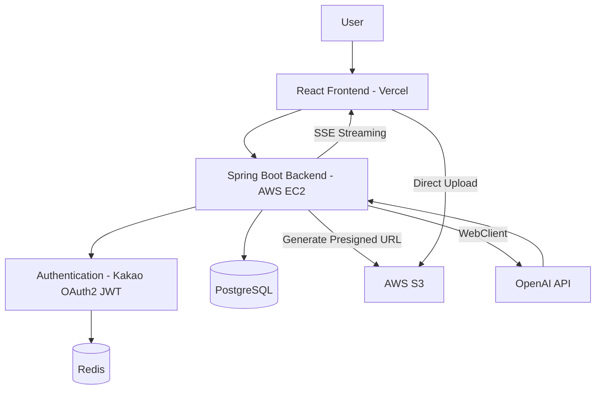
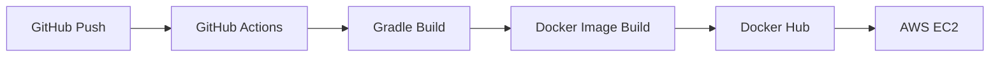

<div align="center">

# 


### Start · Prepare · Reach OUT

AI 기반 커리어 아카이브 서비스

가볍게 흘려보낸 오늘의 기록이, 내일의 커리어 자산이 됩니다.

<br>

[](https://openjdk.org/)
[](https://spring.io/projects/spring-boot)
[](https://www.postgresql.org/)
[](https://redis.io/)
[](https://www.docker.com/)
[](https://aws.amazon.com/)

[Service](https://sprout-efub.vercel.app/login) · [API](https://api.sprout-p-e.p-e.kr/) · [API Documentation](https://app.notion.com/p/API-38fe46b1b00c80e19f51f8a9adba3d87) · [Frontend Repository](https://github.com/EFUB-SWS-MANDO/Frontend)

</div>

---

## Overview

SPROUT는 사용자의 경험을 기록하고 AI를 활용해 커리어 자산으로 발전시키는 AI 기반 커리어 아카이브 서비스입니다.

프로젝트, 스터디, 세미나 등 다양한 경험을 기록하면 AI가 이를 분석하여 자기소개서 작성과 모의 면접까지 이어질 수 있도록 지원합니다.

---

## Project Overview

| Item | Details |
|------|---------|
| Development | 2026.07.01 ~ 2026.08.08 (6 Weeks) |
| Type | Club Project |
| Language | Java 17 |
| Framework | Spring Boot |
| Database | PostgreSQL, Redis |

---

## Features

| Feature | Description |
|---------|-------------|
| Experience Archive | 자유 기록, 템플릿 기록, 태그 및 카테고리 관리, 파일 첨부 |
| AI Career Assistant | AI 자기소개서 생성, AI 모의 면접, SSE 스트리밍 |
| Social | 게시글 공유, 팔로우, 댓글 |
| Statistics | 활동 통계, 기록 추이, 카테고리 분석 |

---

## ERD


---

## Architecture



<br>

### Key Components

| Component | Responsibility |
| --- | --- |
| Redis | Refresh Token 저장, JWT 블랙리스트 관리, SSE 세션 관리 및 캐시 |
| S3 | Presigned URL 기반 파일 업로드 |
| OpenAI | AI 자기소개서 및 모의면접 생성 |
| JWT / OAuth2 | 사용자 인증 및 인가 처리 |


---

## Tech Stack

### Backend


### Database


### Infrastructure


### AI & Communication


### Testing


---

## Project Structure

Domain-Driven Structure를 적용하여 도메인별 패키지를 분리하고, 공통 모듈은 global 패키지에서 관리합니다.

```
├── domain
│   ├── auth
│   ├── member
│   ├── post
│   ├── comment
│   ├── follow
│   ├── resume
│   ├── interview
│   └── motivation
│
└── global
    ├── ai
    ├── config
    ├── common
    └── error
```

---

## API Documentation

[API Documentation](https://app.notion.com/p/API-38fe46b1b00c80e19f51f8a9adba3d87)

---

## Team

| Name | GitHub | Contribution |
| --- | --- | --- |
| 전채연 | [@RockScissors](https://github.com/RockScissors) | 프로젝트 초기 설정, AI Interview/Follow/Template/Category 도메인 개발, Statistics API 구현 |
| 김남우 | [@namwoooo](https://github.com/namwoooo) | Resume/Comment 도메인 개발, AWS S3 Presigned URL 기반 파일 업로드, 배포 환경 구성 |
| 박서영 | [@sum-young](https://github.com/sum-young) | Spring Security 인증/인가, Member/Profile/Post 도메인 개발 |

---

## Getting Started

### Prerequisites

- Java 17
- Docker
- PostgreSQL 17
- Redis 7

### Clone

```bash
git clone https://github.com/EFUB-SWS-MANDO/Backend.git
cd Backend
```

### Configuration

애플리케이션 실행을 위해 아래 환경 변수를 설정해야 합니다.

| Variable | Description |
| --- | --- |
| `SPRING_DATASOURCE_URL` | PostgreSQL connection URL |
| `SPRING_DATASOURCE_USERNAME` | Database username |
| `SPRING_DATASOURCE_PASSWORD` | Database password |
| `REDIS_HOST` | Redis host |
| `REDIS_PORT` | Redis port |
| `JWT_SECRET` | JWT signing key |
| `OPENAI_API_KEY` | OpenAI API key |
| `AWS_ACCESS_KEY_ID` | AWS access key |
| `AWS_SECRET_ACCESS_KEY` | AWS secret key |
| `S3_BUCKET_NAME` | S3 bucket name |

### Run

Docker Compose로 의존성 서비스를 실행한 뒤 애플리케이션을 실행합니다.

```bash
docker compose up -d

./gradlew bootRun
```

---

## CI/CD  

GitHub Actions를 통해 `main` 브랜치 push 시 자동 빌드 및 배포가 수행됩니다.


